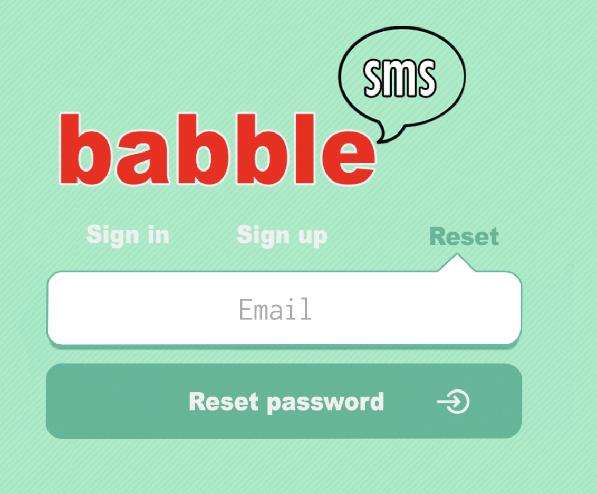

# README


# GETTING STARTED

## Python Flask / pip Installation / Socketio / SQLAlchemy
* [PIP](https://www.educative.io/edpresso/installing-pip3-in-ubuntu)
* [Python Flask](https://dev.to/sahilrajput/install-flask-and-create-your-first-web-application-2dba)
* [Socket io](https://socket.io/docs/server-installation/)
* [SQL Alchemy](https://www.tutorialspoint.com/sqlalchemy/sqlalchemy_introduction.htm)

## Node Install
* [node](https://nodejs.org/en/download/package-manager/)

## Fun Translate API
* [fun translate API](https://funtranslations.com/api/)
* [Jokes API](https://jokes.one/api/joke/)

<hr />
<br />
1. First start by installing Socket io:

```bash
    npm install
    pip install flask-socketio
    pip install eventlet
    npm install -g webpack
    npm install --save-dev webpack
    npm install socket.io-client --save
```

2. Next instal and setup SQL Alchemy

```bash
    sudo yum install postgresql postgresql-server postgresql-devel postgresql-contrib postgresql-docs
```
3. Initialize database
```bash
    sudo service postgresql initdb
    sudo service postgresql start
```
4. Create user
```bash
    sudo -u postgres createuser --superuser $USER
    # create new database
    sudo -u postgres createdb $USER
    #make sure user shows up
    psql
    \du #as user
    \l # database
    #create user
    create user some_username_here superuser password 'some_unique_new_password_here';
    #quit
    \q
```
5. PSQL with alchemy:
```bash
    pip install psycopg2-binary
    pip install Flask-SQLAlchemy==2.1
```
6. create a new env file and add:

```env
SQL_USER=YOURUSERNAMEHERE
SQLPASSWORD=YOURPASSWORD HERE
```

7. Gauth
Head over to https://console.developers.google.com/ and sign up for a developer account.
Click "CREATE PROJECT" or in the dropdown menu called "Select a Project" in the top, click "NEW PROJECT". Make a new project named my project. Click "Credentials" in the left hand bar, then click "+ CREATE CREDENTIALS" and then click "OAuth client ID".
4.5. If you see a warning that says "To create an OAuth client ID, you must first set a product name on the consent screen", do the following steps: 1. Click the "CONFIGURE CONSENT SCREEN" button. 2. Choose "External" 3. For "Application name," specify "MY APP" or something similar. 4. Press save.
Go back to Credentials -> Create Credentials -> OAuth client ID. Click "web application".

<b>IMPORTANT!!:</b> <br />
In order NOT to expose your API keys to the rest of the world, please ensure when making commits NOT to include this file and that your .gitignore file has .env in it.  I have included a .gitignore with this repo so just double check whenever you are making a commit : )
<br />
<br />
6. Once the file is saved, source the tweepy.env by typing in your terminal:
<br />

```bash
source sql.env
```
<br />
7. Now run the app by typing into your terminal: 
<br />
<br />

```bash
python app.py
```
<br />

<br />
7. Now run the app by typing into your terminal: 
<br />
<br />

```bash
run npm watch
```


<b>THINGS TO TAKE NOTE OF:</b> <br />
This app uses [Bootstrap](https://getbootstrap.com/docs/3.4/getting-started/) for all html/css styling.  In order to edit custom css please edit the style.css in the directory ../static/css.  Also, changes to the css will require you to clear your web browser's cache!

<br />

# Answers to questions:
<em>What is a technical issue you encountered with your project? How did you fix it?</em><br />

-The first issue that I ran into was properly figuring out the right format or syntax of reading and writing via python.  Setting up the database and creating the ability to read and write through c9 was a little challenging for me.  Fortunately, I have previous experience with python and sql and I was able to use to previous to solving my problem.  The specfic issue was, whenever I tried accessing my database via console, it asked me for a password that never creating (I was unable to access my database).  After some googling, I looked in my database .conf file and I had to change a line to "local" authentication.  Solved the problem!

-The second issue I faced was properly configuring npm to run watch.  This is overall was probably my biggest headache.  I would sometimes face these weird problems where when I ran npm it would error out and after reinstalling it in it's entirity it would work.  This project was the first time I've used webpack and npm run watch and I feel my problem was an experience issue.  With using it more and more I feel those issuses would be non-exsistent.

-The third issue I faced was forgetting to source my file before running my application.  I would constant have an error in my code and I would spend at least 15-20 minutes trying to debug working code to realize I hadn't source my tweepy.env file.  So I imported the python dotenv module and added a line to the top of my code to source the file for me.

<em>What is a known issue that still exists app?  If you had more time how would you have fixed it?</em><br />

There are a couple of ways I'd improve this project if I had more time.  First, I would like to style the interface a little better.  Specfically, the login page.  This is what I wanted to implement:



